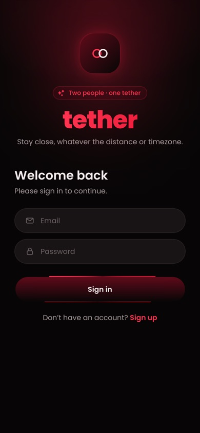
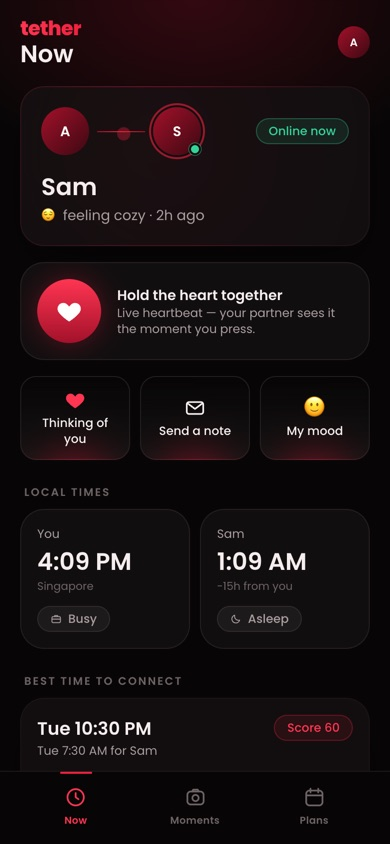
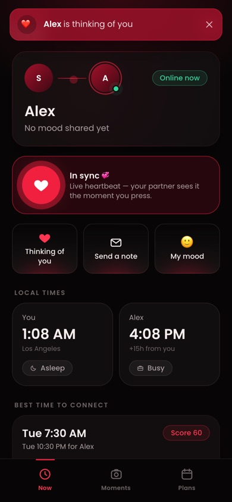
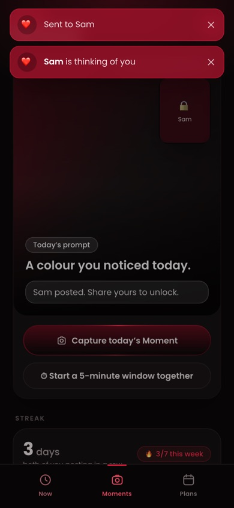
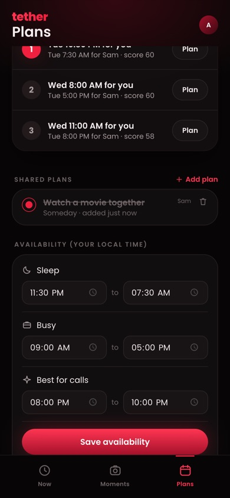

# Tether

**A private, two-person app for staying close across distance and timezones.**

Tether links exactly two people. Once you’re paired, it gives you small, low-effort ways to feel present in each other’s day. You can hold a heart together in real time, trade a daily photo, see each other’s local time and mood at a glance, and find a call time that works in both timezones. Everything syncs live across every device either of you is signed in on.

**Live demo:** https://tether-div.vercel.app. Sign in with any email and password, type any pairing code, and you’ll be paired with a simulated partner. See [Demo mode](#demo-mode).

<p>
  
  
  
  
  
</p>

---

## Contents

- [Why Tether](#why-tether)
- [Features](#features)
- [Demo mode](#demo-mode)
- [How it works](#how-it-works)
- [Tech stack](#tech-stack)
- [Run it locally](#run-it-locally)
- [Testing](#testing)
- [Deployment](#deployment)
- [Configuration](#configuration)
- [Project structure](#project-structure)
- [API reference](#api-reference)
- [Design](#design)
- [Limitations](#limitations)
- [Roadmap](#roadmap), including the **iOS widget**
- [Project history](#project-history)

---

## Why Tether

Long-distance relationships and friendships run on small signals, not long calls. Most messaging apps are built for conversations. Tether is built for *presence*, meaning the things you’d notice if you shared a room:

- Is my person awake right now, or at work?
- Did they have a good day?
- When can we actually talk, given a 15-hour time difference?
- A quick “thinking of you” that doesn’t demand a reply.

Tether is deliberately limited to **one partner per account**. It’s a shared space for two people, not a social feed.

---

## Features

### 🔗 Pairing
- Sign up with email and password, and stay signed in on as many devices as you like.
- One person generates a **6-character pairing code**. It expires after 10 minutes and uses no look-alike characters such as 0/O or 1/I. The other person types it in.
- The person waiting on the code screen is moved into the app **automatically** the moment their partner connects.
- Either partner can **unpair**, and both apps return to the pairing screen at once.

### ❤️ Now tab: “what’s happening with you right now?”
- **Partner card:** online/offline status, current mood, and a live indicator.
- **Hold the heart together:** press and hold the heart, and your partner’s screen pulses while you hold. When you both hold at the same time, both screens show **In sync 💞**. This is sent live and never stored.
- **Thinking of you:** a one-tap ping, with a toast (and a vibration on supported phones) on every one of your partner’s devices.
- **Notes:** short messages of up to 280 characters.
- **Mood:** pick an emoji and an optional word or two.
- **Local times:** both clocks side by side, the hour difference, and whether each of you is *asleep*, *busy*, *free* or *free to talk*, based on your availability.
- **Best time to connect:** the top-ranked call slot in both local times, with a score.
- **Live activity feed** of everything either of you did.

### 📸 Moments tab: one photo a day
- A **daily prompt** shared by both partners, e.g. *“Something that reminded you of me.”*
- **One Moment per day** per person. Photos are resized in the browser before upload, which also converts iPhone HEIC files.
- **Post yours to unlock:** your partner’s photo from the last 24 hours stays locked until you’ve shared your own.
- **Shared capture window:** either of you can start a 5-minute countdown that appears on both screens. Photos posted inside it are marked *on time ⚡️*.
- **Reactions:** 👀 Seen, 😊 Smiled, 💞 Heart Spark.
- **Streak and weekly recap:** consecutive days you *both* posted, plus a 7-day grid of who posted when.
- **Timeline:** a photo grid of your shared history.

### 🗓 Plans tab: planning across timezones
- **Ranked call times** for the next 24 hours. Each 30-minute slot is scored for both people:
  - Any slot where either person is asleep is excluded.
  - Preferred call time scores highest, free time next, and busy time lowest.
  - The top three picks are spread out so they aren’t all back-to-back.
- **Availability:** each person sets their sleep, busy and preferred-call hours in their own local time. Windows that cross midnight are supported.
- **Shared plans:** a title, an optional date and time (shown in *both* timezones) and notes. Either of you can edit, tick off or delete a plan.
- **Memory search** across plans, Moment captions and prompts, notes and moods.

### 🔄 Multi-device sync
- Every change is saved first, then pushed over WebSockets to **every open device of both partners**, including your own other devices.
- When a phone locks and its connection drops, the app reconnects and refetches as soon as it’s visible again, so nothing is missed.

---

## Demo mode

The hosted demo at **https://tether-div.vercel.app** runs entirely in the browser with no backend.

| | Demo mode | Full mode |
|---|---|---|
| Sign in | Any email and password | Real accounts (hashed passwords) |
| Pairing | Type **any** code, or generate one | Real 6-character codes between two people |
| Partner | **Sam**, a simulated partner | A real second person |
| Data | Stored in *this browser* (localStorage) | SQLite on the server, photos on disk |
| Sync between devices | ❌ Each browser is its own demo | ✅ Live across all devices |
| Needs a server | No (static hosting) | Yes (FastAPI + WebSockets) |

What Sam does in the demo:
- Welcomes you when you pair, then pings you back and replies to your notes.
- Holds the heart back when you hold it, so you reach *In sync*.
- Reacts 💞 to your Moment, and posts a photo when you open a capture window.
- Replies to new plans, and pings you when you share a mood.
- The account starts with **three days of history**: Moments, a streak, plans and activity, so every screen has content.

A normal tab and an incognito tab each get their own separate demo; they can’t see each other. To test two real people interacting, run [full mode](#run-it-locally).

Demo mode is switched on at build time with `VITE_TETHER_DEMO=true`. The logic lives in [`frontend/src/api/demo.js`](frontend/src/api/demo.js), which implements the same interface as the real API client and WebSocket.

---

## How it works

```
 Device A (browser)                                   Device B (browser)
 ───────────────────                                  ───────────────────
 React app ──HTTP /api──┐                        ┌──HTTP /api── React app
            ──WS /api/ws┤                        ├──WS /api/ws──
                        ▼                        ▼
                  ┌──────────────── FastAPI ────────────────┐
                  │  auth · pairing · moments · plans · …   │
                  │  WebSocket hub (per-user socket sets)   │
                  └───────┬──────────────────────┬──────────┘
                          ▼                      ▼
                 SQLite (tether.db)      uploads/ (photos)
```

1. **Write first, then broadcast.** Every change (ping, note, photo, reaction, plan, availability, mood) is stored in SQLite and recorded in a `pair_events` log. The server then pushes that event to every open socket belonging to either partner.
2. **Screens refetch on relevant events.** Each screen subscribes to the event types it cares about. For example, the Plans tab reloads on `plan_created`, `plan_updated` and `plan_deleted`. This keeps the client simple and consistent: the server is always the source of truth.
3. **Presence** is simply “does this user have at least one open socket?”. Partners are notified when that changes.
4. **Hold together** is sent over the socket and **never stored**.
5. **Reconnect and resync.** The client reconnects with backoff (and immediately when the page becomes visible), then refetches everything.
6. **Photos** are served through signed URLs, so they can be shown in `` tags without exposing session tokens.
7. **Streaks across timezones.** Partners can be on different calendar dates, so shared days are counted in one reference timezone per pair (the code creator’s), and both partners see the same streak.

---

## Tech stack

| Layer | Technology |
|---|---|
| Frontend | React 18, Vite 5, Tailwind CSS 3, Poppins |
| UI components | Adapted from [21st.dev · prebuiltui](https://21st.dev/@prebuiltui) and themed black / dark red |
| Backend | FastAPI, Uvicorn, WebSockets, Pydantic |
| Storage | SQLite (WAL mode) + photos on the local filesystem |
| Auth | Email + password (scrypt hashing), random session tokens stored as SHA-256 hashes |
| Tests | Python multi-device WebSocket smoke test; Puppeteer two-browser UI test |
| Hosting | Vercel (static demo), Docker (full app on any container host) |

---

## Run it locally

**Requirements:** Python 3.12+, Node.js 18+.

### One command

```bash
./scripts/dev.sh
```

On the first run it creates the Python virtual environment and installs dependencies. It then starts both servers and prints:

```
  This computer:            http://localhost:5173
  Phones on the same Wi-Fi: http://192.168.x.x:5173
```

Open the first link on your computer and the second on a phone on the same Wi-Fi. Sign up with **two different emails**, one per device (or use a normal plus a private/incognito window).

### Manually

```bash
# Backend (API + WebSockets) on :8000
cd backend
python3 -m venv .venv
.venv/bin/pip install -r requirements.txt
.venv/bin/uvicorn app.main:app --host 127.0.0.1 --port 8000

# Frontend on :5173 (proxies /api and the WebSocket to :8000)
cd frontend
npm install
npm run dev          # full mode
npm run dev:demo     # demo mode, no backend needed
```

Data is stored in `backend/data/` (the database, uploaded photos and a signing key). Delete that folder to start fresh.

---

## Testing

### Automated multi-device test (backend)
Simulates **Alex’s phone** plus **Sam’s laptop and Sam’s phone** (the same account on two devices) over real WebSockets, and checks 22 behaviours: pairing, presence, pings, notes, mood, hold-together, capture windows, locked Moments, reactions, streaks, plans, availability, call slots, search and unpairing.

```bash
backend/.venv/bin/python scripts/two_device_smoke.py http://localhost:5173
```

### Manual two-device test
[`docs/TWO_DEVICE_TEST.md`](docs/TWO_DEVICE_TEST.md) is a 20-step script. For each step it says what should appear on the *other* device without refreshing. It also covers network setup, firewall prompts, and a tunnel for devices on different networks.

---

## Deployment

### Demo on Vercel (static)
[`vercel.json`](vercel.json) builds `frontend/` in demo mode and serves it as a single-page app:

```json
{
  "installCommand": "npm ci --prefix frontend",
  "buildCommand": "npm run build:demo --prefix frontend",
  "outputDirectory": "frontend/dist"
}
```

Import the repository into Vercel (no framework preset needed) and deploy.

### Full app with Docker
The [`Dockerfile`](Dockerfile) builds the frontend, then runs FastAPI, which serves the API, the WebSocket hub, uploaded photos **and** the built app on one port:

```bash
docker build -t tether .
docker run -p 8000:8000 -v tether-data:/data tether
```

On a container host (Render, Railway, Fly.io and similar):
- Mount a **persistent volume at `/data`** so accounts and photos survive restarts.
- Run **a single instance**. Presence and live events are kept in that server’s memory.
- Hosting must support WebSockets. Vercel serverless functions do not, which is why Vercel only hosts the demo.

To combine the two, set `VITE_TETHER_API_URL` to the full backend’s URL and build without demo mode. The frontend will then talk to that backend.

---

## Configuration

| Variable | Where | Default | Purpose |
|---|---|---|---|
| `VITE_TETHER_DEMO` | Frontend build | unset | `true` = in-browser demo with a simulated partner |
| `VITE_TETHER_API_URL` | Frontend build | same origin | Backend URL when the frontend is hosted separately |
| `TETHER_BACKEND` | Vite dev server | `http://127.0.0.1:8000` | Where the dev proxy sends `/api` and WebSocket traffic |
| `TETHER_DATA_DIR` | Backend | `backend/data` | Location of the SQLite database, uploads and signing key |
| `PORT` | Backend (Docker) | `8000` | Port Uvicorn listens on |

---

## Project structure

```
tether/
├── backend/
│   ├── app/
│   │   ├── main.py          # App setup, health check, serves frontend/dist in production
│   │   ├── db.py            # SQLite schema and query helpers
│   │   ├── auth.py          # Sign up / sign in / sessions (scrypt, hashed tokens)
│   │   ├── pair_access.py   # "Who is my partner?" helpers and the require_pair dependency
│   │   ├── pairing.py       # Pairing codes, status, unpair
│   │   ├── realtime.py      # WebSocket hub: events, presence, hold-together relay
│   │   ├── features.py      # Profile, mood, notes, moments, reactions, plans, availability, stats, search
│   │   └── scheduling.py    # Cross-timezone call-slot ranking
│   └── requirements.txt
├── frontend/
│   ├── src/
│   │   ├── api/
│   │   │   ├── client.js    # REST + WebSocket client (switches to demo mode when enabled)
│   │   │   └── demo.js      # In-browser backend and simulated partner
│   │   ├── features/
│   │   │   ├── auth/        # AuthProvider (session)
│   │   │   └── sync/        # PairProvider (live connection, presence, live refetch)
│   │   ├── components/ui/   # 21st.dev-derived UI kit: GlowCard, BorderButton, Toasts, Sheet, Menu…
│   │   ├── screens/         # Auth, Profile, Pair, Now, Moments, Plans
│   │   └── lib/             # Time zones, image compression, event labels
│   ├── tailwind.config.js   # Black / dark-red design tokens and animations
│   └── vite.config.js       # Dev proxy for /api and WebSockets
├── scripts/
│   ├── dev.sh               # Start everything and print device URLs
│   └── two_device_smoke.py  # Automated multi-device test
├── docs/
│   ├── TWO_DEVICE_TEST.md   # Manual two-device test plan
│   └── screenshots/
├── archive/                 # Original Supabase-based plan (no longer used)
├── Dockerfile               # Full app in one container
└── vercel.json              # Static demo build
```

---

## API reference

All endpoints are under `/api`. Endpoints that need a signed-in user take `Authorization: Bearer <token>`, and paired-only endpoints return `409` if you aren’t paired.

| Method & path | Purpose |
|---|---|
| `POST /api/auth/signup` · `POST /api/auth/signin` · `POST /api/auth/signout` · `GET /api/auth/me` | Accounts and sessions |
| `PATCH /api/me/profile` | Display name and timezone |
| `POST /api/me/mood` | Share a mood (emoji and note) |
| `POST /api/pairing/create-code` · `POST /api/pairing/redeem-code` | Create and redeem pairing codes |
| `GET /api/pairing/status` · `POST /api/pairing/unpair` | Current partner, online status, unpair |
| `GET /api/events` · `POST /api/events` | Activity feed; send a ping (`nudge`) or `note` |
| `GET /api/moments` · `POST /api/moments` (multipart) | Today’s prompt, capture window and timeline; post a photo |
| `POST /api/moments/window` | Start a shared 5-minute capture window |
| `POST /api/moments/{id}/reactions` | React: `seen`, `smiled`, `heart_spark` |
| `GET /api/media/{file}?sig=…` | Signed photo download |
| `GET /api/plans` · `POST /api/plans` · `PATCH /api/plans/{id}` · `DELETE /api/plans/{id}` | Shared plans |
| `GET /api/availability` · `PUT /api/availability` | Sleep, busy and preferred windows (`HH:MM-HH:MM`) |
| `GET /api/call-slots` | Top 3 call times for the next 24 hours |
| `GET /api/stats` | Streak, 7-day grid, weekly recap |
| `GET /api/search?q=` | Search plans, Moments, notes and moods |
| `GET /api/health` | Health check |
| `WS /api/ws` | Live connection (see below) |

**WebSocket protocol.** The client sends `{"type":"auth","token":"…"}` first, then:

| Direction | Message | Meaning |
|---|---|---|
| Server → client | `hello` | Authenticated; includes whether your partner is online |
| Server → client | `event` | Something changed (`nudge`, `note`, `moment_created`, `plan_updated`, …) |
| Server → client | `presence` | Your partner came online or went offline |
| Server → client | `pair_changed` | You were paired or unpaired |
| Server → client | `touch` | Your partner started or stopped holding the heart |
| Client → server | `ping` | Keep-alive (the server replies `pong`) |
| Client → server | `touch` | You started or stopped holding the heart |

---

## Design

The UI is a dark, mobile-first design in **black and deep red**, sized like an iPhone. On phones it fills the screen; on laptops it sits in a phone frame so demos look the same everywhere.

Several components are adapted from the [21st.dev prebuiltui](https://21st.dev/@prebuiltui) collection and recoloured to Tether’s palette:

| Tether component | Based on |
|---|---|
| `GlowCard`: red glow that follows your pointer or finger | Glowing Border On Hover Card |
| `BorderButton`: animated spinning red border | Button With Dual Border Animation |
| `GlowIconButton`: quick actions on the Now tab | Glowing Button With Hover Effect |
| Pill inputs with icons | Modern Login Form With Icons |
| Badges and the sparkle tagline | Growth Badge Tag, Announcement Badge With Sparkle |
| Avatars with a presence dot | Avatar Group |
| Toasts for live activity | Success Alert Fill |
| Account menu | User Select Dropdown |
| Plan checkbox and toggles | Dot Checkbox, Toggle Switch |
| Locked-photo notice and photo grid | Notify Card With Glass Effect, Image Grid Gallery |

Design tokens (colours, shadows, animations) live in [`frontend/tailwind.config.js`](frontend/tailwind.config.js).

---

## Limitations

Tether is a working proof of concept, not a production service yet.

- **Security:** there’s no email verification or password reset, sessions never expire, and local development runs over plain HTTP.
- **Scale:** the live-sync hub is kept in memory, so the backend must run as a single instance.
- **Storage:** SQLite and photos on local disk are fine for a small number of users; large photo libraries would need object storage.
- **Demo mode** can’t sync between browsers, by design.
- **Daily prompts** come from a curated list and aren’t generated per couple.
- **Notifications** only appear while the app is open; there are no push notifications yet.

---

## Roadmap

### 📱 iOS home-screen widget (planned)

The most natural next step is to bring Tether’s *presence* to the home and lock screen, so you can feel close without opening the app.

**Widget ideas**

| Widget | Size | Shows |
|---|---|---|
| **Partner at a glance** | Small / lock screen | Partner’s local time, *asleep / busy / free to talk*, mood emoji, online dot |
| **Today’s Moment** | Medium | Partner’s latest photo (or 🔒 *post yours to unlock*), today’s prompt, streak 🔥 |
| **Next call** | Small / lock screen | Best call time in your timezone, or the next scheduled plan with a countdown |
| **Thinking of you** | Small (interactive) | A heart button that sends a ping **from the widget**, without opening the app |

**Beyond the widget**
- **Live Activity and Dynamic Island** for the 5-minute Moment capture window, with a countdown visible to both partners.
- **Push notifications** for pings, notes, new Moments and window starts, using Apple Push Notification service (APNs).
- **Haptics:** a “heartbeat” vibration when your partner holds the heart.

**How it would be built**
1. **Native iOS app shell.** Either wrap the existing UI in an iOS app (SwiftUI, or React Native/Expo reusing the current screens and design tokens) or build SwiftUI screens against the same API. The original plan already considered Expo, and the design tokens translate directly.
2. **WidgetKit extension** that reads a small “snapshot” shared with the app through an **App Group**: partner name, timezone, availability state, mood, latest photo thumbnail, streak and next call slot.
3. **New backend endpoints:**
   - `GET /api/widget/snapshot`: one compact payload containing everything a widget needs.
   - `POST /api/devices`: register an APNs device token for each signed-in device.
4. **Keeping widgets fresh:**
   - Timeline refreshes (for example every 15–30 minutes, plus at your partner’s sleep and wake boundaries).
   - **Silent push** when something changes (new Moment, mood update) to trigger an immediate widget reload.
5. **Interactive widgets (iOS 17+):** use **App Intents** so the heart button calls `POST /api/events` with a `nudge` directly from the home screen.
6. **Lock screen and StandBy** variants reuse the same snapshot data.

### Other enhancements
- **Push notifications on the web** (installable PWA with web push) as a stepping stone before native iOS.
- **Production hardening:** HTTPS by default, email verification, password reset, session expiry, rate limiting.
- **Storage:** move photos to object storage (S3-compatible) and the database to Postgres for multi-instance deployments.
- **Scaling realtime:** a shared pub/sub layer (e.g. Redis) so more than one server instance can host sockets.
- **AI daily prompts** tailored to each pair’s history and timezones.
- **Countdown to next visit**, shared playlists, and “open when…” letters.
- **Calendar sync** so busy hours and plans come from Google or Apple Calendar.
- **End-to-end encryption** for notes and photos.

---

## Project history

- **Original plan (May–June 2026):** Tether started as a mobile-first web app built on Supabase (auth, Postgres, Realtime). That plan and its SQL are kept in [`archive/`](archive/).
- **Rebuild (September 2026):**
  - Moved to a **self-hosted** FastAPI + SQLite + WebSocket backend with no cloud dependencies.
  - Finished every feature end to end and redesigned the UI with 21st.dev components.
  - Added an automated multi-device test and an in-browser **demo mode** for backend-free hosting on Vercel.
